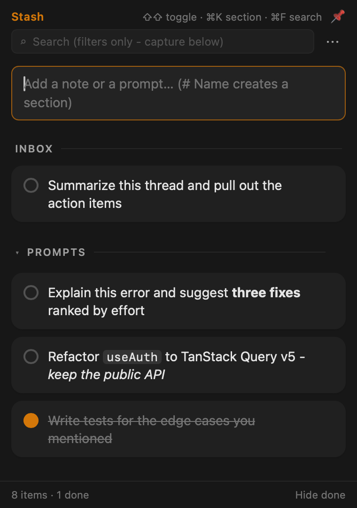
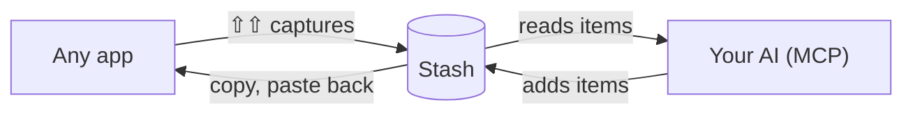

# 📌 Stash

> A floating quick-capture panel for macOS, built for AI-assisted work.




## Why

Working with AI tools means constantly collecting little things you don't
want to lose: an answer worth keeping, a link, an idea, or three follow-up
prompts that occur to you while the current one is still generating. They end
up scattered across ChatGPT, Claude, Cursor, browser tabs, and random notes.

**Stash** keeps them in one place, one shortcut away. It combines the useful
parts of a to-do list, a clipboard, and a scratchpad in a small always-on-top
panel that sits next to whatever you're working on. Capture without switching
context, send items back into any app through the clipboard, and check them
off as you go.

## Features

- **⇧⇧ global capture** - double-tap Shift from any app to toggle the panel.
  The capture input is focused and ready to type. If you had text selected
  in the app you came from, it's captured automatically (your clipboard is
  left untouched).
- **Checklist workflow** - check items off as you use them; hide the done
  ones when you're finished.
- **One-click copy** - click any item to copy it to the clipboard.
- **Multi-select** - ⌘-click several items, then ⌘C copies them as one text.
  ⌫ deletes the selection.
- **Sections** - type `# Name` to create a section; everything you capture
  lands there until you switch. Cycle with ⌘K or click a section header.
- **Link detection** - URLs are recognized and styled automatically.
- **Drag to sort** - reorder items and sections by dragging.
- **Pin control** - 📌 toggles always-on-top.
- **100% local and private** - no account, no sync, no telemetry, zero
  network requests. Your notes live in one JSON file on your Mac.

## Install

### Download

Grab the latest `.dmg` from
[Releases](https://github.com/JustaName-id/stash/releases), open it, and
drag **Stash** to Applications. The app is not notarized (it's a local-first
hobby project), so on first launch either right-click → Open, or clear the
quarantine flag:

```sh
xattr -cr /Applications/Stash.app
```

### Build from source

Requires [Rust](https://rustup.rs), Node.js 20+, and [pnpm](https://pnpm.io):

```sh
git clone git@github.com:JustaName-id/stash.git
cd stash
pnpm install
pnpm tauri build
```

> Tip: builds are adhoc-signed by default, and macOS invalidates permission
> grants on every adhoc rebuild. Create a local code-signing cert (e.g.
> "Stash Dev" via Keychain Access) and build with
> `APPLE_SIGNING_IDENTITY="Stash Dev" pnpm tauri build` so Accessibility and
> Input Monitoring grants survive rebuilds.

Then move `src-tauri/target/release/bundle/macos/Stash.app` to
`/Applications` (a `.dmg` is also produced under `bundle/dmg/`).

> **Permissions:** the double-Shift shortcut needs **Input Monitoring** (to
> see the Shift presses) and **Accessibility** (for selection capture) under
> System Settings → Privacy & Security. The app prompts for both on first
> launch and shows a banner while anything is missing; the shortcut activates
> a few seconds after granting. If you rebuild the app, remove and re-add the
> entries - macOS ties them to the binary's signature. Heads-up: JetBrains
> IDEs bind ⇧⇧ themselves (Search Everywhere), so both will fire there.

## Keyboard reference

| Shortcut | Action |
|----------|--------|
| ⇧⇧ | Toggle the panel from anywhere |
| Enter | Capture what you typed (`# Name` creates a section) |
| Shift+Enter | New line in the capture input |
| ⌘K | Cycle active section: All → each section → All |
| ⌘-click | Toggle an item in the multi-selection |
| ⌘C | Copy the selection as one newline-joined text |
| ⌫ / Delete | Delete the selected items |
| Esc | Clear the selection, or hide the panel |

Closing the window only hides it - the app keeps running for ⇧⇧. Click the
Dock icon to bring the panel back at any time; quit with ⌘Q.

## Privacy & data

Stash makes **zero network requests** - enforced by a restrictive CSP and
verifiable in the source (no HTTP client anywhere). The global key listener
only distinguishes Shift from not-Shift; keystroke contents are never read,
stored, or logged.

Your items live in a single JSON file:
`~/Library/Application Support/com.mariano.stash/stash.json`. If the file is
ever corrupt it's renamed to a timestamped `.bak`, never overwritten.

> **Note:** items are stored as plain text (no at-rest encryption). If you
> paste secrets, anything that can read your user files can read them - keep
> FileVault enabled.

## How it flows



Capture from anywhere with a double-Shift, let your AI read and add items
through MCP, send things back through the clipboard - everything stays in one
local file on your Mac.

## AI access (MCP)

Stash ships a local [MCP](https://modelcontextprotocol.io) server so your AI
tools can read your stash and capture into it - still 100% local (stdio, no
ports, no network). Tools: `list_items`, `search_items`, `add_item`. Writes
land in a sidecar inbox that the running app merges within seconds; the
server never touches `stash.json` directly.

Build it once:

```sh
cd mcp && pnpm install && pnpm build
```

Then register it in your client (restart the client afterwards - MCP
servers load at startup):

**Claude Code**

```sh
claude mcp add stash -- node /path/to/stash/mcp/dist/index.js
```

**Claude Desktop** - add to
`~/Library/Application Support/Claude/claude_desktop_config.json`:

```json
{
  "mcpServers": {
    "stash": {
      "command": "node",
      "args": ["/path/to/stash/mcp/dist/index.js"]
    }
  }
}
```

**Cursor** - Settings → MCP → *Add new global MCP server*, same
`command`/`args` shape as above.

Then ask your AI things like *"what's pending in my Stash?"*, *"save this
prompt to my Prompts section"*, or *"add the three follow-ups we discussed
to my stash"*.

## Development

```sh
pnpm tauri dev     # run the app with hot reload
pnpm test          # frontend store tests (Vitest)
cargo test         # Rust tests (run in src-tauri/)
pnpm build         # typecheck + bundle the frontend
```

**Stack:** Tauri v2 shell, React 19 + TypeScript + Tailwind v4 + Zustand
frontend, Rust for OS integration. The double-Shift detector is a pure,
unit-tested state machine (`src-tauri/src/double_shift.rs`) fed by an `rdev`
global event tap; UI state lives in a single Zustand store persisted with a
debounce through `tauri-plugin-store`.

```
src/                  # React UI (components, store, persistence glue)
src-tauri/src/        # Tauri setup, commands, global shortcut listener
src-tauri/capabilities/  # Least-privilege IPC permission grants
```

## Contributing

Issues and PRs are welcome. Please keep changes aligned with the project's
principles: local-first (no network, ever), never silently destroy data, and
keyboard-first for core flows. Run `pnpm test` and `cargo test` before
submitting.

## License

[MIT](LICENSE)
